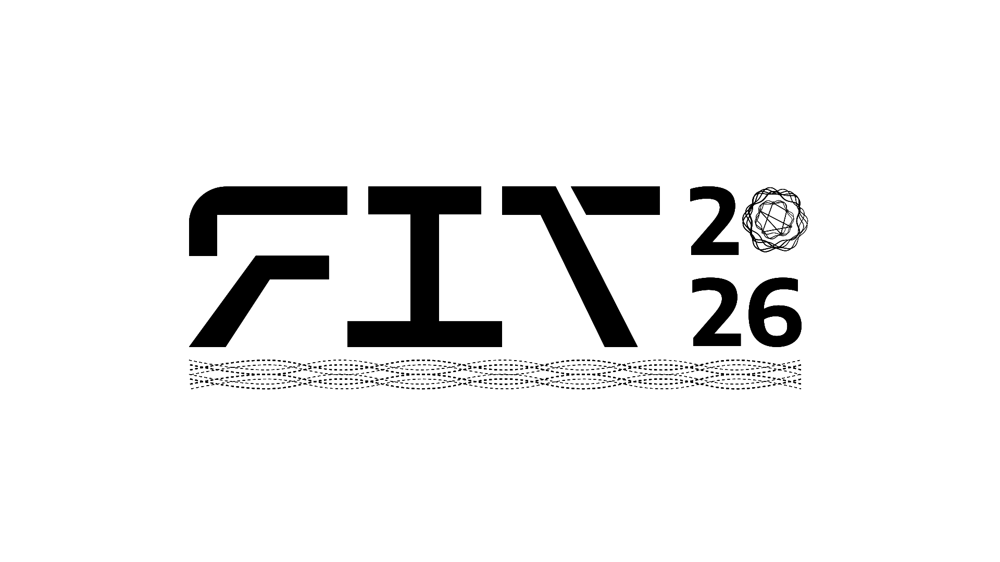

# FIT 2026 — XIII Fórum de Inovação e Tecnologia



**Design (Figma):** https://www.figma.com/design/G9g2X63V1NWueLViuVeemw/FIT-2026?node-id=0-1&t=vCJauIb6DqxANiBX-1

**Tema:** Inteligência Artificial: suas Aplicações e Desafios  
**Data:** 04 a 08 de Outubro de 2026  
**Local:** UFC — Campus Crateús, Ceará

---

## Visão Geral do Sistema

Este projeto é o site oficial do FIT 2026, o maior evento universitário de tecnologia do Sertão de Crateús. O sistema é composto por:

| Arquivo | Descrição |
|---------|-----------|
| `index.html` | Página principal pública do evento |
| `coming-soon.html` | Página de pré-lançamento/antecipação |
| `auth/admin.html` | Painel administrativo (CRUD de palestrantes/patrocinadores) |

---

## Arquitetura

```
fit-2026-main/
├── index.html              # Página principal do evento
├── coming-soon.html        # Página "Em Breve" (pré-evento)
├── auth/
│   ├── admin.html          # Painel administrativo
│   ├── admin.js           # Lógica do painel admin
│   └── admin.css         # Estilos do painel admin
└── assets/
    ├── css/
    │   └── style.css      # Estilos globais do site
    ├── js/
    │   ├── script.js       # JavaScript do site principal
    │   └── firebase-config.js  # Configuração Firebase
    ├── data/
    │   └── programacao.json    # Programação do evento (5 dias)
    └── img/               # Imagens e logos
```

---

## Tecnologias Utilizadas

| Tecnologia | Finalidade |
|------------|------------|
| **HTML5** | Estrutura semântica das páginas |
| **Tailwind CSS** | Framework CSS utilitário (via CDN) |
| **CSS Customizado** | Estilos específicos do tema IA |
| **JavaScript (ES6)** | Interatividade e lógica |
| **Font Awesome 6** | Ícones |
| **Google Fonts (Inter)** | Tipografia |

---

## Páginas

### 1. Página Principal (`index.html`)

#### Seções:
- **Header/Navbar**: Navegação fixa com menu responsivo (mobile)
- **Hero**: Apresentação do evento com countdown e ilustração animada de IA
- **Countdown**: Timer regressivo para o evento
- **Programação**: Abas por dia com cards das atividades
- **Palestrantes**: Grid de cards (carregados do Firebase)
- **Patrocinadores**: Seções por categoria (Diamante, Prata, Apoio de Mídia)
- **Sobre o Evento**: História do FIT e edições anteriores
- **Organizadores**: Logos das instituições realizadoras
- **Footer**: Contato, redes sociais e créditos

#### Funcionalidades JavaScript:
- **Countdown**: Atualização em tempo real (dias, horas, minutos, segundos)
- **Menu Mobile**: Toggle de abertura/fechamento
- **Scroll Suave**: Navegação por âncoras
- **Header Scroll**: Efeito de background ao rolar
- **Fade-in Animations**: Animações de entrada ao scroll
- **Programação Dinâmica**: Carregamento do JSON
- **Palestrantes/Patrocinadores**: Dados embutidos na interface estática

---

### 2. Página "Em Breve" (`coming-soon.html`)

Página minimalista para o período pré-evento, contendo:
- Logo animado FIT 2026
- Tagline do tema
- Countdown regressivo
- Botões: Voluntário (link para formulário) e Edição 2025
- Seção de organizadores com logos
- Partículas animadas de fundo
- Ícone de cérebro IA com animação de desenho SVG

---

### 3. Painel Administrativo (`auth/admin.html`)

Sistema de gerenciamento para organizadores do evento.

#### Autenticação:
- Login via simulação / credenciais estáticas (Firebase removido)
- Proteção de rotas simples no frontend

#### Funcionalidades:

##### Palestrantes (CRUD):
| Campo | Descrição |
|-------|-----------|
| `nome` | Nome completo |
| `cargo` | Função/título |
| `tema` | Tema da palestra |
| `foto` | URL da foto (opcional) |
| `ordem` | Posição de exibição |

##### Patrocinadores (CRUD):
| Campo | Descrição |
|-------|-----------|
| `nome` | Nome da empresa |
| `tier` | Categoria (diamante/prata/midia) |
| `logo` | URL do logo (opcional) |
| `ordem` | Posição de exibição |

#### Interface:
- Tabela listando itens com ações (Editar/Excluir)
- Modais para adicionar/editar registros
- Notificações toast para feedback
- Badges coloridos por categoria de patrocinador

---


## Programação (JSON)

O arquivo `programacao.json` contém a estrutura de 5 dias de evento:

```json
{
  "dias": [
    {
      "id": "day1",
      "label": "Dia 1",
      "data": "04/10",
      "diaSemana": "Domingo",
      "atividades": [
        {
          "horario": "08:00 - 09:00",
          "titulo": "Credenciamento",
          "palestrante": "Diretoria",
          "local": "Pátio da UFC",
          "tipo": "abertura",
          "tipoLabel": "Abertura"
        }
      ]
    }
  ]
}
```

#### Tipos de Atividade:
| Tipo | Cor | Descrição |
|------|-----|-----------|
| `abertura` | Roxo | Cerimônias, aberturas, encerramento |
| `palestra` | Laranja | Palestras principais |
| `minicurso` | Rosa | Workshops e minicursos |
| `coffee` | Verde | Intervalos e coffee breaks |
| `startufc` | Azul | Competições e eventos especiais |

---


## Tema Visual

### Paleta de Cores:
| Cor | Hex | Uso |
|-----|-----|-----|
| Laranja | `#FF6A00` | Acentos primários |
| Vermelho | `#FF3700` | Alertas, destaques |
| Verde Neon | `#00FF09` | Sucesso, online |
| Verde Escuro | `#009405` | Secundário |
| Azul Escuro | `#021031` | Background principal |
| Azul Claro | `#00C7F8` | Links, interativos |
| Preto | `#000000` | Fundos, contraste |

### Elementos Visuais:
- Gradientes diagonais em background
- Cards com bordas sutis
- Ícones flutuantes animados
- Chip de IA central na hero
- Circuitos neurais em SVG
- Efeitos de glow em elementos interativos

---

## Responsividade

O site é totalmente responsivo com breakpoints em:
- **Desktop**: > 1024px (layout completo)
- **Tablet**: 768px - 1024px (grid adaptado)
- **Mobile**: < 768px (menu hamburger, cards empilhados)

---

## SEO

### Meta Tags:
- Description e Keywords otimizadas
- Open Graph para redes sociais
- Twitter Cards
- Schema.org (Event e WebSite)
- Canonical URL

---

## Fluxo de Uso

### Visitante Comum:
1. Acessa o site → vê informações completas do evento
2. Navega pela programação
3. Conhece palestrantes e patrocinadores
4. Clica em "Inscreva-se" → redirecionamento para formulário externo

### Administrador:
1. Acessa `/auth/admin.html`
2. Faz login (email/senha ou Google)
3. Gerencia palestrantes (CRUD)
4. Gerencia patrocinadores (CRUD)
5. Alterações refletem automaticamente no site público

---

## Segurança

- Interface estática sem backend conectado
- Página admin com `noindex, nofollow` para não aparecer em buscas

---

## Próximos Passos para Produção

1. **Formulário de Inscrição**: Criar/vincular formulário externo (Google Forms, Typeform, etc.)
2. **Hospedagem**: Deploy em GitHub Pages, Vercel ou similar
3. **Domínio**: Configurar domínio customizado (fit.crateus.ufc.br)

---

## Pendências e Tarefas

### Design/UI
- [x] **Atualizar tema visual**: Aplicar nova paleta de cores e estilo
- [ ] **Logo na Hero**: Substituir ilustração SVG do chip de IA pela logo oficial (`assets/img/logo-fit-2026.svg`)
- [ ] **OG Image**: Criar imagem Open Graph (1200x630px)
- [ ] **Favicon SVG**: Atualizar favicon com nova identidade visual

### Funcionalidades
- [ ] **Link de Inscrição**: Configurar URL real do formulário de inscrição
- [ ] **Formulário Voluntários**: Atualizar link do Google Forms
- [ ] **Contagem Regressiva**: Data correta configurada (04/10/2026)

### Dados
- [ ] **Cadastrar Palestrantes**: Adicionar dados reais dos palestrantes no Firebase
- [ ] **Cadastrar Patrocinadores**: Adicionar empresas e logos no Firebase
- [ ] **Verificar Programação**: Confirmar atividades e horários do JSON

### Administrativo
- [ ] **Validação de conteúdo**: Adicionar validações nos formulários do admin

### Imagens
- [ ] **Logos Organizadores**: Adicionar logos de:
  - [ ] FIT Crateús
  - [ ] UFC
  - [ ] Sebra
  - [ ] GSIPP
  - [ ] EngineLab
  - [ ] SPARC
- [ ] **Fotos Palestrantes**: Adquirir fotos profissionais
- [ ] **Logo Sponsor Placeholder**: Criar placeholder para patrocinadores sem logo

---

## Equipe de Desenvolvimento

**Núcleo de Comunicação do FIT — UFC Crateús**

- Vicente Neto

---

## Edições Anteriores

- FIT 2025 — Internet das Coisas
- FIT 2024 — Segurança em Redes
- FIT 2023 — Otimização
- FIT 2022 — Era dos Dados
- FIT 2021 — Empreendedorismo
- FIT 2020 — Cloud Computing
- FIT 2019 — Inteligência Artificial
- FIT 2018 — Eu amo Inovação
- FIT 2017 — 4ª Edição

---

*FIT 2026 — XIII Fórum de Inovação e Tecnologia*
*Universidade Federal do Ceará — Campus Crateús*
